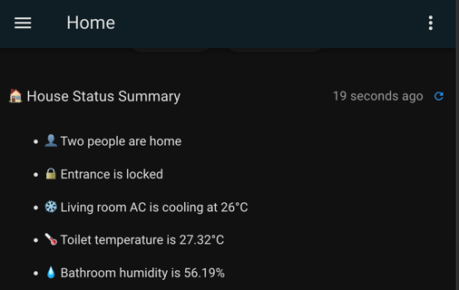
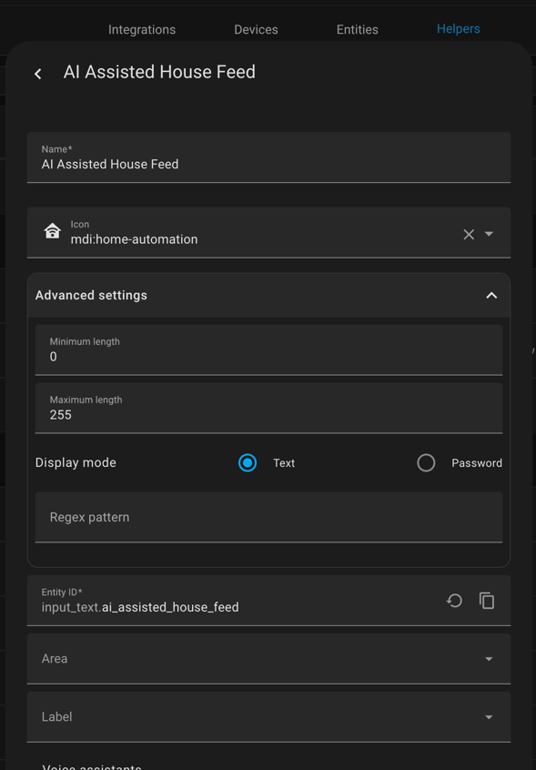

# Get AI powered House Feed on your dashboard

By passing a list of entities to AI agent, you may get a nice summary of your 
house like:

## Steps

1. Create a `input_text` helper
   

2. Copy the [automation.yaml](./automation.yaml) 

3. Provide your own entities by updating the `variables` section

4. You may also update the `time_pattern` which has default value 'per 30 mins'

5. Feel free to update the prompt to suit your situation

6. Check out the dashboard configuration at [dashboard.yaml](./dashboard.yaml)

   Note: `heading` and `markdown` cards are being used

## Note

`input_text` has a maximum limit of 255 characters. Be careful about it.