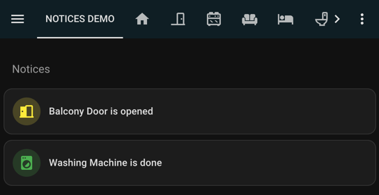
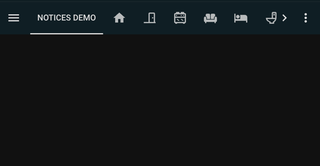

# Notices Section

## Description
It creates a notices section on the dashboard. The notices are shown only when 
certain condition is fulfilled. If there is no any notices, the 'Notices' title 
will be hidden as well!

This is achieved by css hack only. No extra virtual sensor needed to be 
created. It would be extremely easy for supporting new notices in the 
future.

## Showcases

### When there is notices:

### When there is no notices 

## Dependencies
- [lovelace-card-mode](https://github.com/thomasloven/lovelace-card-mod)
- [lovelace-mushroom](https://github.com/piitaya/lovelace-mushroom)

## Notes
Since the pseudo-class `:has()` is used, please confirm your usage on 
[can-i-use](https://caniuse.com/css-has) beforehand.
